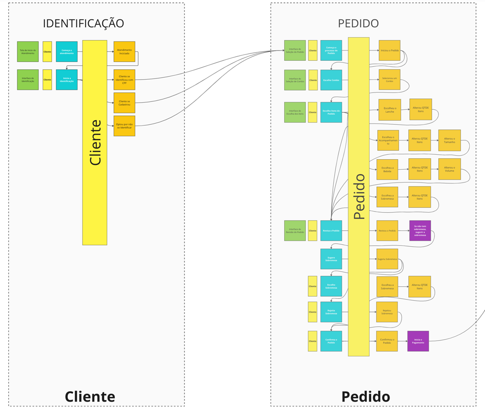

# tech-challenge-fiap
Sistema de Gerenciamento de Pedidos - Fast Food

##  Grupo 33
[Wellington da Silva Alencar](https://github.com/wellalencarweb) | rm353081

[Link do Projeto](https://github.com/wellalencarweb/tech-challenge-fiap-fase-02)

[Link do Event Storm](https://miro.com/app/board/uXjVNVCMJaU=/?share_link_id=723408841855)

[Link da Documentação da API](http://localhost:6001/api-docs)

[Dockerfile](Dockerfile)

[docker-compose](docker-compose.yml)

# Fase 2 - Kubernetes

## Arquitetura Kubernetes

Para instalação é indispensavel ter `docker`, `docker-compose`, `minikube`, `kubernets` instalado em sua máquina.

Clonar o Projeto `https://github.com/wellalencarweb/tech-challenge-fiap-fase-02.git`
[Link do Projeto](https://github.com/wellalencarweb/tech-challenge-fiap-fase-02.git)

## Instalação via Kubernets
1) Start minikube: `minikube start`
2) Acesse o diretório `cd tech-challenge-fiap-fase-02` e depois `cd k8s`
3) Execute as secrets: `kubectl apply -f secret-opaque.yaml`
4) Execute o POD do BD (sem volume): `kubectl apply -f mongodb-pod.yaml`
5) Execute o service do BD: `kubectl apply -f mongodb-service.yaml`
6) Faça o Deployment da Aplicação: `kubectl apply -f app-deployment.yaml`
7) Suba Load Balancer:`kubectl apply -f load-balancer-service.yaml`
8) Metrics: `kubectl apply -f metrics.yaml`
9) HPA: `kubectl apply -f hpa.yaml`

## Acesso
1) Execute `minikube service app-load-balancer --url`(irá exibir o ip do loadBalancer)
2) Acesse a API e DOCs http://**ip-load-balancer**:**port-load-balancer**/api-docs

## Desinstalação
1) Verifique se está no contexto do minikube: `kubectx` 
2) Delete todos os componentes: `kubectl delete all --all`
3) Pare o minikube: `minikube stop`

## Instalação via Docker

1) Após clonar o projeto acesse `cd tech-challenge-fiap-fase-02`
2) Execute: `docker compose -f docker-compose.yml up -d`
3) Ficará disponível no endereço [http://localhost:6001/](http://localhost:6001/), rodando na porta `:6001`

## Documentação da API
* Disponível no endereço [http://localhost:6001/api-docs](http://localhost:6001/api-docs)

## Desenvolvimento do projeto

### Diagramas

Foram utilizadas técnicas de Domain Driven Design para definição dos fluxos:

- Identificação do Cliente e Início do Pedido

  

- Pagamento

  

- Preparação e Entrega

  

### Dicionário da Linguagem Ubíqua
- Dicionário

  
